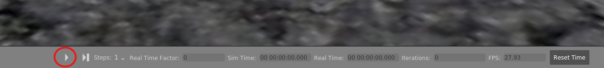

# Double SLS Controller

[](https://youtu.be/GrKxC1hDQOI "DSLS Tracking")
Video available at https://www.youtube.com/watch?v=GrKxC1hDQOI

## Install/Getting Started  
### 1. Install PX4-Autopilot v1.14
```
git clone https://github.com/PX4/PX4-Autopilot.git --recursive
cd ~/PX4-Autopilot
git submodule update
cd ~
bash ./PX4-Autopilot/Tools/setup/ubuntu.sh
cd ~/PX4-Autopilot
make px4_sitl gazebo-classic
```

If you haven't already created a catkin workspace, create one following these instructions:
```
cd ~/
mkdir catkin_ws/src
cd catkin_ws
catkin init
```
### 2. Install ROS Noetic & MAVROS  
Follow the guide at https://docs.px4.io/main/en/ros/mavros_installation.html  
### 3. Install Gazebo Link Attacher
```
cd catkin_ws/src  
git clone https://github.com/pal-robotics/gazebo_ros_link_attacher.git  
cd ..
catkin build
```
### 4. Install Double SLS Controller
```
cd ~/catkin_ws/src
git clone https://github.com/ANCL/double_sls_controller.git --recursive
cd ..
catkin build
```
### 5. Move the Link Attacher Script
```
sudo cp ~/catkin_ws/src/double_sls_controller/scripts/attach_sls.py ~/catkin_ws/src/gazebo_ros_link_attacher/scripts/attach_sls.py
```   
### 6. Install XMLStarlet if not already done
```
sudo apt install xmlstarlet
```
### 7. Modify /.bashrc
```
sudo vim ~/.bashrc
```  
add following contents:
```
# For PX4v1.14
source /opt/ros/noetic/setup.bash
source ~/catkin_ws/devel/setup.bash
source ~/PX4-Autopilot/Tools/simulation/gazebo-classic/setup_gazebo.bash ~/PX4-Autopilot ~/PX4-Autopilot/build/px4_sitl_default

export ROS_PACKAGE_PATH=$ROS_PACKAGE_PATH:~/PX4-Autopilot
export ROS_PACKAGE_PATH=$ROS_PACKAGE_PATH:~/PX4-Autopilot/Tools/simulation/gazebo-classic/sitl_gazebo-classic
export GAZEBO_PLUGIN_PATH=$GAZEBO_PLUGIN_PATH:/usr/lib/x86_64-linux-gnu/gazebo-11/plugins
export GAZEBO_MODEL_PATH=$GAZEBO_MODEL_PATH:~/catkin_ws/src/double_sls_controller/models
```
## Run DSLS SITL
### 1. Launch PX4 SITL
```
# in a new terminal
roslaunch double_sls_controller double_px4vision_sls_world.launch
```  
### 2. Attach the Drones and the Slung Load
```
# in a new terminal
rosrun gazebo_ros_link_attacher attach_sls.py
```
Then unpause the simulation:

### 3. Run QGroundControl
```
# in a new terminal
cd
./QGroundControl.AppImage
```
### 4. Launch Double SLS Contoller
```
# in a new terminal
roslaunch double_sls_controller double_sls_node.launch
```
### 5. Run Dynamic Reconfigure Gui
```
# in a new terminal
rosrun rqt_reconfigure rqt_reconfigure
```
* Move sliders to change gains and references
* Check tick-box "dea_preintegrate_enabled" to let controller states converge
* Check tick-box "dea_enabled" to enable DEA
* Check tick-box "mission_enabled" to start set-point and trajectory tracking mission
