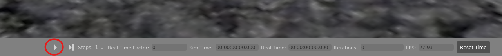

# Double SLS Controller

Video available at https://www.youtube.com/watch?v=GrKxC1hDQOI

## WSL2-Based Environment Installation
### 0. Install WSL2 & Ubuntu 20.04
Follow the guide at https://docs.px4.io/main/en/dev_setup/dev_env_windows_wsl.html.

### 1. Install PX4-Autopilot v1.13.2
Follow the guide at https://docs.px4.io/main/en/contribute/git_examples.html#get-a-specific-release, or
1. Clone PX4-Autopilot repository and navigate to the directory
```
git clone https://github.com/PX4/PX4-Autopilot.git
cd ~/PX4-Autopilot
```
2. Check out code for desired tag
```
git checkout v1.13.2
```
3. Update submodules
```
make submodulesclean
```
4. Install Dependencies
```
cd ~
bash ./PX4-Autopilot/Tools/setup/ubuntu.sh
```
5. Restart WSL2
```
exit
wsl --shutdown
wsl
```
6. Install Dependencies
```
sudo apt-get install protobuf-compiler libeigen3-dev libopencv-dev -y
```
7. Build PX4 SITL
```
cd ~/PX4-Autopilot
make px4_sitl
```
### 2. Install ROS Noetic & MAVROS  
Follow the guide at https://docs.px4.io/main/en/ros/mavros_installation.html, or
1. Retrieve the latest package lists and install
```
sudo apt update
sudo apt upgrade
```
2. Setup ROS sources list
```
sudo sh -c 'echo "deb http://packages.ros.org/ros/ubuntu $(lsb_release -sc) main" > /etc/apt/sources.list.d/ros-latest.list'
```
3. Setup the keys
```
sudo apt install curl # if you haven't already installed curl
curl -s https://raw.githubusercontent.com/ros/rosdistro/master/ros.asc | sudo apt-key add -
```
4. Install ROS
```
sudo apt install ros-noetic-desktop-full
```
5. Setup environment
```
echo "source /opt/ros/noetic/setup.bash" >> ~/.bashrc
source ~/.bashrc
```
6. Install and initialized dependencies 
```
sudo apt install python3-rosdep python3-rosinstall python3-rosinstall-generator python3-wstool build-essential
sudo apt install python3-rosdep
sudo rosdep init
rosdep update
```

7. Install ROS python tools
```
sudo apt-get install python3-catkin-tools python3-rosinstall-generator -y
```
8. Create ROS workspace folder
```
mkdir -p ~/catkin_ws/src
cd ~/catkin_ws
catkin init
wstool init src
```
9. Install MAVLink
```
# We use the Kinetic reference for all ROS distros as it's not distro-specific and up to date
rosinstall_generator --rosdistro kinetic mavlink | tee /tmp/mavros.rosinstall
```

10. Install MAVROS with source installation 
```
rosinstall_generator --upstream mavros | tee -a /tmp/mavros.rosinstall
```
Modify the "version" tag of MAVROS entry in ~/catkin_ws/src/.rosinstall
to make it look like below:
```
- git:
    local-name: mavlink
    uri: https://github.com/mavlink/mavlink-gbp-release.git
    version: release/kinetic/mavlink/2021.3.3-1
- git:
    local-name: mavros
    uri: https://github.com/mavlink/mavros.git
    version: 1.16.0  
```
Then install the dependency:
```
wstool merge -t src /tmp/mavros.rosinstall
wstool update -t src -j4
```

### 3. Install Gazebo Link Attacher
```
cd catkin_ws/src  
git clone https://github.com/pal-robotics/gazebo_ros_link_attacher.git  
cd ..
catkin build
```
### 4. Install Double SLS Controller
```
cd ~/catkin_ws/src
git clone https://github.com/ANCL/double_sls_controller.git --recursive
cd ..
catkin build
```
### 5. Move the Link Attacher Script
```
sudo cp ~/catkin_ws/src/double_sls_controller/scripts/attach_sls.py ~/catkin_ws/src/gazebo_ros_link_attacher/scripts/attach_sls.py
chmod +x ~/catkin_ws/src/gazebo_ros_link_attacher/scripts/attach_sls.py
```   
### 6. Install XMLStarlet if not already done
```
sudo apt install xmlstarlet
```
### 7. Modify /.bashrc
```
sudo vim ~/.bashrc
```  
add following contents:
```
# For ROS Noetic
source /opt/ros/noetic/setup.bash
source ~/catkin_ws/devel/setup.bash

# For Gazebo 11
export GAZEBO_PLUGIN_PATH=$GAZEBO_PLUGIN_PATH:/usr/lib/x86_64-linux-gnu/gazebo-11/plugins
export GAZEBO_MODEL_PATH=$GAZEBO_MODEL_PATH:~/catkin_ws/src/double_sls_controller/models

# For PX4 v1.13.2
source ~/PX4-Autopilot/Tools/setup_gazebo.bash ~/PX4-Autopilot ~/PX4-Autopilot/build/px4_sitl_default
export ROS_PACKAGE_PATH=$ROS_PACKAGE_PATH:~/PX4-Autopilot
export ROS_PACKAGE_PATH=$ROS_PACKAGE_PATH:~/PX4-Autopilot/Tools/sitl_gazebo
```


## Run DSLS SITL
### 1. Launch PX4 SITL
```
# in a new terminal
roslaunch double_sls_controller double_px4vision_sls_world.launch
```  
Note: If the vehicles are not generated properly in the GUI try relaunching this command.
### 2. Attach the Drones and the Slung Load
```
# in a new terminal
rosrun gazebo_ros_link_attacher attach_sls.py
```
Then unpause the simulation:

### 3. Run QGroundControl
```
# in a new terminal
cd
./QGroundControl.AppImage
```
### 4. Launch Double SLS Contoller
```
# in a new terminal
roslaunch double_sls_controller double_sls_node.launch
```
### 5. Run Dynamic Reconfigure Gui
```
# in a new terminal
rosrun rqt_reconfigure rqt_reconfigure
```
* Move sliders to change gains and references
* Check tick-box "dea_preintegrate_enabled" to let controller states converge
* Check tick-box "dea_enabled" to enable DEA
* Check tick-box "mission_enabled" to start set-point and trajectory tracking mission
